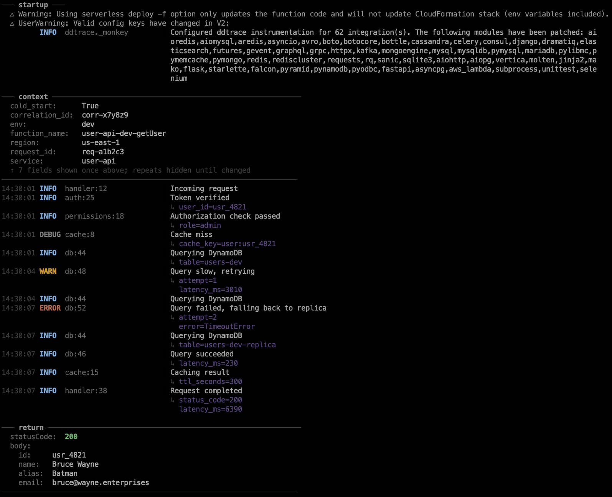
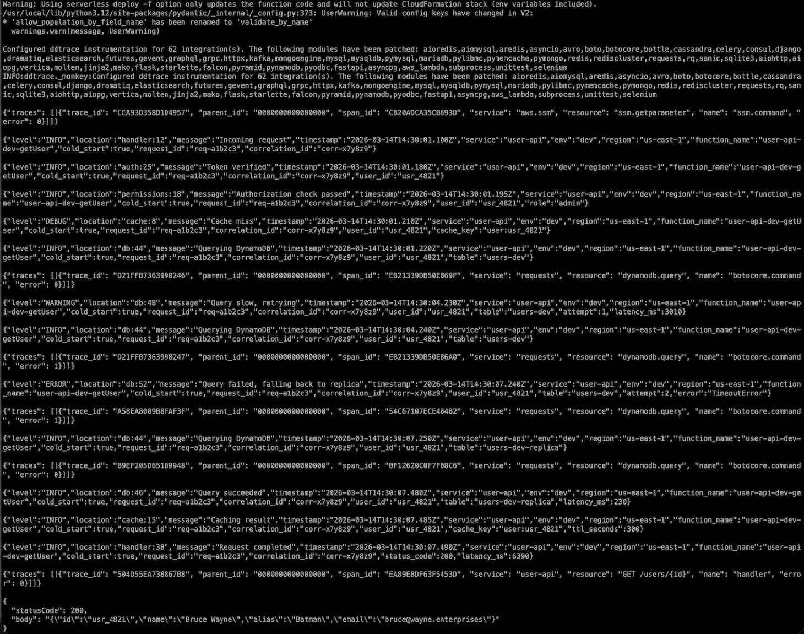

# clogs

A terminal formatter for structured AWS Lambda logs. Pipe in noisy
Powertools / Lambda JSON and get colorized, readable output.

- Suppresses noise - ddtrace spans, `null` returns, framework banners
- Detects stable fields (like `service`, `request_id`) and shows them once
  in a context block - not on every line
- Hides repeated metadata until values actually change
- Formats each log line as `timestamp LEVEL location │ message`
- Colors levels, timestamps, and tags so you can scan quickly
- No dependencies, just the Python standard library

`cat examples/example.log | clogs`



<details>
<summary>Without clogs - <code>cat examples/example.log</code></summary>



</details>

## Install

Requires **Python 3.9+**. Install from source with [uv](https://docs.astral.sh/uv/):

```bash
git clone https://github.com/JasonSatti/clogs.git
cd clogs
uv tool install .
```

Or with pip:

```bash
git clone https://github.com/JasonSatti/clogs.git
cd clogs
pip install .
```

## Usage

Pipe any command that emits supported logs:

```bash
sls invoke local -f my-function --data '{}' | clogs
sam local invoke MyFunction | clogs
aws logs tail /aws/lambda/my-function --follow | clogs
```

Or read from a file:

```bash
clogs < output.log
```

Flags:

```bash
# Show all fields on every line (no suppression)
clogs -v

# Control how many records are buffered for context detection (default: 5)
clogs -c 10

# Disable the context block entirely
clogs --context 0
```

> **Note:** When piping, only stdout reaches `clogs`. If your tool writes logs
> to stderr, merge streams first: `my-command 2>&1 | clogs`

`clogs` respects [`NO_COLOR`](https://no-color.org) - set the env var (any
value) to disable all ANSI codes.

## How it works

**Context block** - the first few JSON records are buffered to find fields
that stay constant (like `service` or `request_id`). Those are shown once
in a header, then suppressed from individual lines.

**Rolling suppression** - extra fields that repeat the same value are shown
once, then hidden until they change. This is the main noise reduction.
Use `-v` to disable suppression and see everything.

**Startup noise** - non-JSON lines before the first log record (framework
banners, config output) are grouped under a `─── startup ───` header.

**Return values** - Lambda return values (multi-line JSON at the end of
output) are formatted as a `─── return ───` block with color-coded
`statusCode` (green for 2xx, yellow for 4xx, red for 5xx).

## Supported formats

| Format | Example |
|---|---|
| Powertools JSON | `{"level": "INFO", "location": "handler", "message": "hello", ...}` |
| Lambda runtime | `[INFO] 2026-03-14T13:35:29.236Z reqId [Thread - main] message` |
| Python stdlib | `INFO:my_logger:message` |

Other lines are passed through dimmed.

## Modes

| Behavior | Default | `-v` | `--context 0` |
|---|---|---|---|
| Colorized output | Yes | Yes | Yes |
| Repeated fields suppressed | Yes | No | Yes |
| Context block at startup | Yes | No | No |

## Customization

Edit [`clogs/config.py`](clogs/config.py) directly:

| Setting | What it controls |
|---|---|
| `COLORS` | 256-color ANSI codes for every element |
| `LOCATION_WIDTH` | Column width for location field (default: 22) |
| `CONTEXT_BUFFER_SIZE` | Records to buffer for context detection (default: 5) |
| `PREFERRED_CONTEXT_FIELDS` | Fields eligible for context block with relaxed rules |

## Development

```bash
uv run pytest
```

## License

[MIT](LICENSE)
