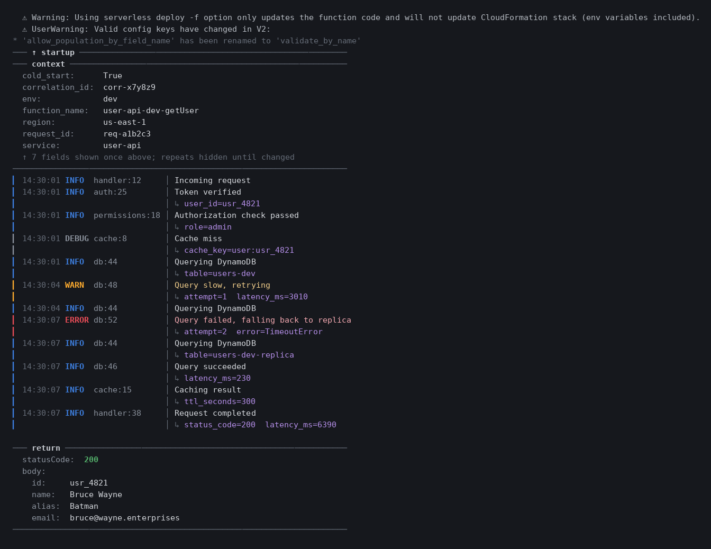
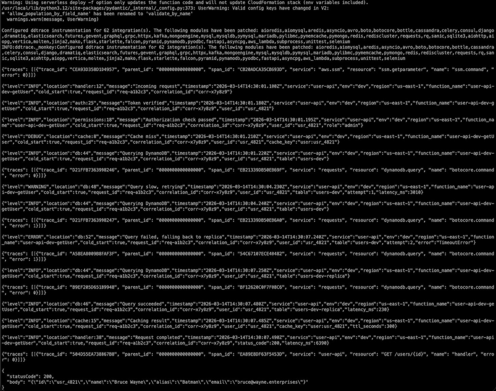
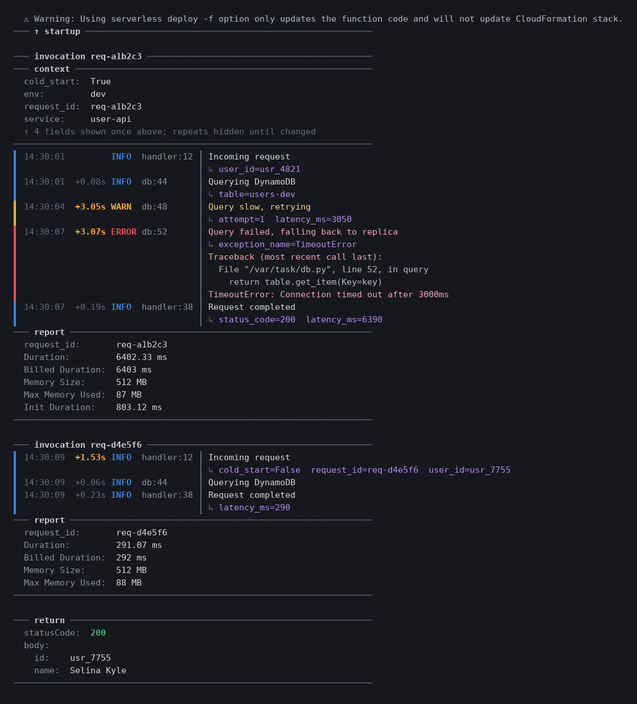

# clogs

A terminal formatter for structured AWS Lambda logs. Pipe in noisy
Powertools / Lambda JSON and get colorized, readable output.

- Suppresses noise - ddtrace spans, `null` returns, framework banners
- Detects stable fields (like `service`, `request_id`) and shows them once
  in a context block - not on every line
- Hides repeated metadata until values actually change
- Formats each log line as `▎ timestamp LEVEL location │ message`, with a
  status-colored edge bar on every row (like Datadog's Log Explorer)
- Marks invocation boundaries (`START` lines / `request_id` changes) and
  renders Lambda `REPORT` lines as a duration/memory summary block
- Renders tracebacks readably - both raw ones and Powertools `exception`
  fields - frames dimmed, the exception line in red
- Filters: `--level warning` for minimum severity, `--grep pattern` to show
  only matching records (with matches highlighted)
- `--delta` shows the elapsed time between records - slow spots jump out
- Columns size themselves to the content: the location column grows only as
  wide as the longest location seen, and the timestamp column disappears
  for streams that don't have timestamps
- Datadog-inspired palette - true 24-bit color when the terminal supports
  it (`COLORTERM=truecolor`), 256-color fallback otherwise
- Configurable via `~/.config/clogs.toml` - colors, layout, default flags
- No dependencies, just the Python standard library

`cat examples/example.log | clogs`



<details>
<summary>Without clogs - <code>cat examples/example.log</code></summary>



</details>

<details>
<summary>With <code>--delta</code> on a multi-invocation stream - invocation dividers, REPORT blocks, traceback rendering</summary>



</details>

## Install

Requires **Python 3.9+**. Install straight from GitHub with
[uv](https://docs.astral.sh/uv/) (no clone needed):

```bash
uv tool install git+https://github.com/JasonSatti/clogs.git
```

Or with pip:

```bash
pip install git+https://github.com/JasonSatti/clogs.git
```

Or from a local checkout:

```bash
git clone https://github.com/JasonSatti/clogs.git
cd clogs
uv tool install .
```

## Usage

Pipe any command that emits supported logs:

```bash
sls invoke local -f my-function --data '{}' | clogs
sam local invoke MyFunction | clogs
aws logs tail /aws/lambda/my-function --follow | clogs
```

Or let clogs run the command itself - this captures stdout *and* stderr in
order, so no `2>&1` dance:

```bash
clogs -- sls invoke local -f my-function --data '{}'
```

Or read from a file:

```bash
clogs < output.log
```

Flags:

```bash
# Show all fields on every line (no suppression)
clogs -v

# Control how many records are buffered for context detection (default: 5)
clogs -c 10

# Disable the context block entirely
clogs --context 0

# Only show WARNING and above
clogs --level warning

# Only show records matching a pattern (case-insensitive regex, highlighted)
clogs --grep "dynamodb|timeout"

# Show elapsed time between records (slow spots colored orange/red)
clogs --delta

# Force colors on/off (default: auto — on for terminals, off when piped)
clogs --color always
clogs --color never

# Render levels as filled chips (Datadog status-chip style)
clogs --badges
```

### Options reference

| Flag | Description | Default |
|---|---|---|
| `-v`, `--verbose` | Show all fields on every line (no suppression) | off |
| `-c N`, `--context N` | Records buffered for context detection (`0` disables the block) | `5` |
| `-l`, `--level LEVEL` | Minimum level to show: `debug`, `info`, `warning`, `error`, `critical` (aliases: `warn`, `crit`, `fatal`) | show all |
| `-g`, `--grep PATTERN` | Only show records matching PATTERN (case-insensitive regex); matches highlighted | show all |
| `-d`, `--delta` | Show elapsed time since the previous record (orange ≥ 1s, red ≥ 5s) | off |
| `--badges` | Render levels as filled chips | off |
| `--color WHEN` | `auto`, `always`, or `never` | `auto` |
| `-- COMMAND` | Run COMMAND and format its merged stdout/stderr; exit code is propagated | — |
| `--version` / `-h` | Version / help | — |

Flag defaults can be changed in the [config file](#configuration); CLI
arguments always win — boolean flags have a `--no-` form (`--no-badges`,
`--no-delta`, `--no-verbose`) and `--level all` clears a configured
minimum level.

### Environment variables

| Variable | Effect |
|---|---|
| [`NO_COLOR`](https://no-color.org) | Non-empty value disables ANSI colors (override with `--color always`) |
| `CLOGS_CONFIG` | Path to the config file (default: `~/.config/clogs.toml`) |
| `COLORTERM` | `truecolor`/`24bit` enables the 24-bit palette; otherwise 256-color codes |
| `COLUMNS` | Overrides the detected terminal width for message wrapping |

> **Note:** When piping, only stdout reaches `clogs` — either merge streams
> (`my-command 2>&1 | clogs`) or let clogs run the command for you
> (`clogs -- my-command`), which captures both in order.

Colors are disabled automatically when output isn't a terminal (e.g.
`clogs > file.log`). `python -m clogs` works too.

## How it works

**Context block** - the first few JSON records are buffered to find fields
that stay constant (like `service` or `request_id`). Those are shown once
in a header, then suppressed from individual lines.

**Rolling suppression** - extra fields that repeat the same value are shown
once, then hidden until they change. This is the main noise reduction.
Use `-v` to disable suppression and see everything.

**Startup noise** - non-JSON lines before the first log record (framework
banners, config output) stream immediately and are closed off with a
`─── ↑ startup ───` rule — the arrow points at the section it labels.

**Invocations** - a `START` line, or a change in `request_id`, emits a
`─── invocation <id> ───` divider; `REPORT` lines become a duration/memory
summary block and `END` lines are suppressed.

**Return values** - Lambda return values (single- or multi-line JSON at the
end of output) are formatted as a `─── return ───` block with color-coded
`statusCode` (green for 2xx, yellow for 4xx, red for 5xx).

## Supported formats

| Format | Example |
|---|---|
| Powertools JSON | `{"level": "INFO", "location": "handler", "message": "hello", ...}` |
| Lambda runtime | `[INFO] 2026-03-14T13:35:29.236Z reqId message` (with or without `[Thread - name]`) |
| Lambda lifecycle | `START` → invocation divider, `REPORT` → summary block, `END` → suppressed |
| Python stdlib | `INFO:my_logger:message` |
| Tracebacks | Raw `Traceback (most recent call last):` blocks and Powertools `exception` fields |
| `aws logs tail` | Any of the above wrapped in the event's ISO timestamp prefix |

Single- or multi-line JSON objects without a `message` field (e.g. invoke
return values) are captured; the final one renders as the `return` block.
Other lines are passed through dimmed.

## Modes

| Behavior | Default | `-v` | `--context 0` |
|---|---|---|---|
| Colorized output | Yes | Yes | Yes |
| Repeated fields suppressed | Yes | No | Yes |
| Context block at startup | Yes | No | No |

## Configuration

Create `~/.config/clogs.toml` (or point `CLOGS_CONFIG` at a file):

```toml
[colors]
# "#RRGGBB" or a 256-palette index; level colors restyle badges too
info = "#3D7FE0"
tag = 140

[layout]
location_width = 22      # cap for the adaptive location column

[context]
extra_preferred_fields = ["tenant_id"]   # extra fields for the context block

[defaults]               # default flags; CLI arguments override
badges = true
delta = true
level = "info"
color = "auto"
context = 5
```

On Python 3.11+ the file is parsed with the standard library's `tomllib`;
older versions use a built-in parser that covers this simple subset.
Defaults for everything live in [`clogs/config.py`](clogs/config.py).

## Development

```bash
uv run pytest        # tests
uvx ruff check .     # lint
```

CI runs both on Python 3.9–3.13 for every pull request.

## License

[MIT](LICENSE)
